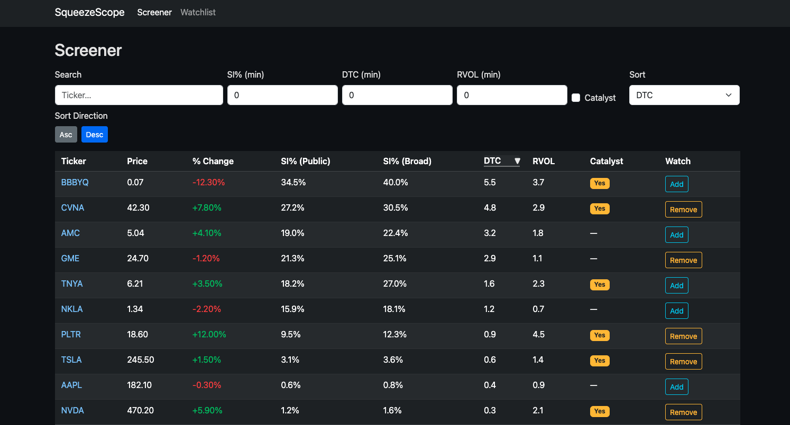
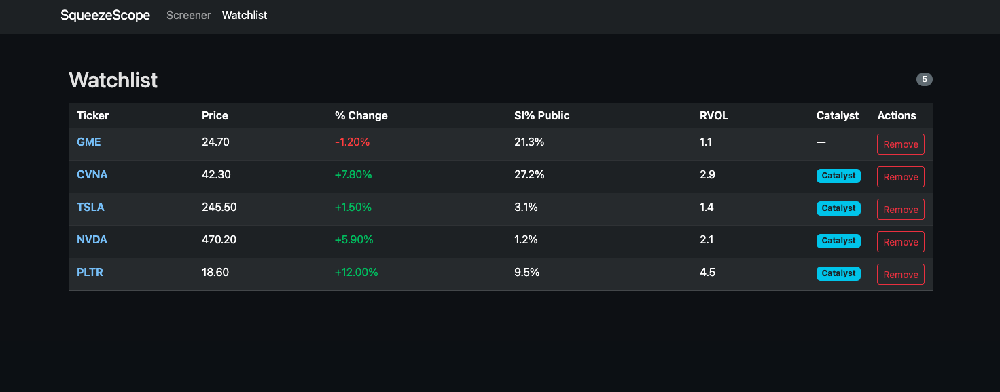
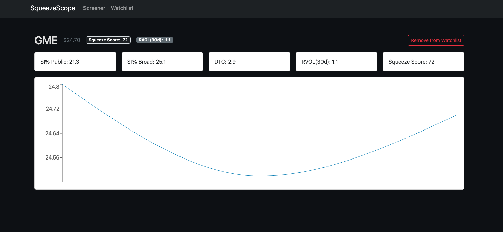

# SqueezeScope — Short Squeeze Screener (React + TypeScript)

**Live Demo:** https://squeeze-scope.vercel.app/

[](https://github.com/HagenGaryP/SqueezeScope/actions/workflows/ci.yml)

SqueezeScope is a stock screener for identifying potential short squeeze candidates using common indicators such as short interest (SI%, public and broad float), days to cover (DTC), relative volume (RVOL), and catalyst flags. It also includes a demo "squeeze score" (a lightweight heuristic for UX demonstration, not a validated trading model). The app is built with production-minded frontend practices (typed domain models, URL-synced filters, and a centralized data client) and uses static fixtures in production while exercising an MSW-backed API layer in development.

> Note: The live demo uses **static fixture data** for deterministic, repeatable behavior (no real-time market data).

---

## Highlights

- Typed domain models and a centralized data client
- URL-synced filters (shareable screener views) and sortable tables
- React Query for async state, caching, and loading/error UX
- MSW in development; static fixtures in production (deployable as a static site)
- Watchlist persistence via `localStorage` with a small tested hook
- Accessibility-minded UX (semantic landmarks, focus management, keyboard-friendly flows)
- Resilient UX: error boundary, empty states, and a first-class 404 flow
- CI quality gates via GitHub Actions (lint, tests, build)

---

## Key features

### Screener

- Filter by:
  - Ticker search
  - Minimum short interest (public and broad float)
  - Days to cover (short ratio)
  - Relative volume
  - Catalyst flag
- Sortable table with sticky headers
- Filter state is synced to the URL (shareable views)

### Watchlist

- Add/remove tickers from the screener and detail pages
- Stored in `localStorage` via a small, tested custom hook
- Compact table layout for at-a-glance monitoring

### Ticker detail

- Summary strip with:
  - Short interest (public and broad float)
  - Days to cover (DTC)
  - Relative volume (RVOL)
  - Squeeze score (demo)
- 60-day price/volume chart via Recharts
- Watchlist toggle integrated into the detail view

### Reliability UX

- App-level `ErrorBoundary` with a friendly fallback
- 404 route with a primary "Back to Screener" call-to-action
- Semantic landmarks and focus considerations for accessibility

---

## Tech stack

- **Framework:** React 19, TypeScript, Vite 7
- **Routing:** React Router 7
- **Data & caching:** `@tanstack/react-query` v5
- **Forms & validation:** React Hook Form + Zod
- **UI:** React-Bootstrap 2, Bootstrap 5, custom CSS (compact dark theme)
- **Charts:** Recharts 3
- **Mock API (dev):** MSW 2
- **HTTP client:** Axios
- **Testing:** Vitest, Testing Library, jest-dom
- **CI:** GitHub Actions (lint, tests, build on PRs)

---

## How data works (dev vs production)

### Development (MSW)

- MSW intercepts:
  - `/api/tickers`
  - `/api/tickers/:symbol`
- The UI still talks to an "API layer" via Axios, but responses are mocked.

### Production (static demo)

- MSW is not started by default in production builds.
- The tickers client switches to typed static fixtures:
  - `tickerFixtures` for screener + watchlist
  - `findOrCreateMetrics(symbol)` for ticker detail metrics and series
- Result: deployable as a **fully static site** (Vercel/Netlify/etc.) with no backend.

---

## Getting started

### Prerequisites

- Node 20+ recommended
- npm (bundled with Node)

### Install & run (local dev)

Clone the repo, then from the project root:

```bash
# install dependencies (recommended: deterministic install using package-lock)
npm ci
# or: npm install

# run dev server (MSW-enabled)
npm run dev
```

Vite will print the local URL in the terminal (default: `http://localhost:5173`).

### Key routes

- `/` — Home
- `/screener` — Screener with filters and a sortable table
- `/ticker/:symbol` — Ticker detail (e.g. `/ticker/TNYA`)
- `/watchlists` — Watchlist view
- `/*` — 404 page

### Quality checks

```bash
npm test
npm run lint
npm run build
npm run preview
```

---

## Project structure

```txt
src/
  main.tsx
  app/
    router.tsx          # central route config
  components/
    Layout/             # AppShell, NavBar
    ui/                 # ErrorBoundary, shared UI helpers
  features/
    tickers/            # Screener, detail page, query + filter + sort helpers
    watchlists/         # watchlist hook, storage helpers, watchlist page
  lib/
    api.ts              # Axios instance
    types.ts            # domain types (TickerRow, TickerMetrics, etc.)
  mocks/
    browser.ts          # MSW worker setup
    handlers.ts         # /api/tickers and /api/tickers/:symbol handlers
    data/               # tickers.json, metrics.json (fixtures)
  styles/
    globals.css         # global theme + layout
  test/
    setup.ts            # Vitest + Testing Library setup
    smoke.test.ts       # basic app smoke test
```

---

## Screenshots

### Screener



### Watchlist



### Ticker detail



---

## Roadmap

The current sprint intentionally avoids real market data ingestion. Future iterations can replace fixtures with a small backend while keeping the existing frontend/data-client architecture.

- Add a minimal serverless API (Azure Functions) that preserves the current REST shape
- Persist user watchlists and snapshots (Cosmos DB or Azure SQL)
- Add basic observability (Application Insights)
- Optional: add an Azure Static Web Apps deployment pipeline in parallel to Vercel (Azure hosting/CI/CD)

---

## License

MIT © 2025 Gary Hagen
